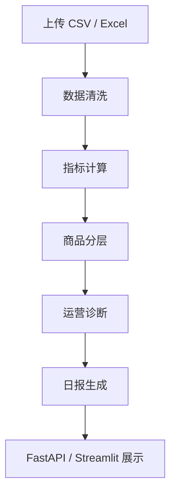

# 技术设计文档

## 目标

EcomPilot AI 面向中小电商商家，提供从数据上传到运营诊断的一体化流程。系统优先保证离线可用：没有大模型密钥时使用规则诊断，有密钥时自动使用大模型增强总结和问答。

## 架构

## 核心模块

- `data_cleaner.py`：字段别名识别、编码兼容、数值清洗、重复商品汇总。
- `metrics.py`：计算 CTR、CVR、GMV、ROAS、客单价、毛利、净利润、退货率、库存风险。
- `product_classifier.py`：根据 ROAS、CVR、净利润、退货率、库存和毛利率进行商品分层。
- `ai_diagnosis.py`：规则诊断、问答、可选 OpenAI 接入。
- `report_generator.py`：生成老板视角的日报。
- `pipeline.py`：串联完整分析链路，供 API 和前端复用。

## 商品分层

系统会优先识别高风险商品，再识别机会商品：

- 爆款商品：ROAS 高、CVR 好、净利润为正、库存充足。
- 高退货风险商品：退货率高且 GMV 不低。
- 亏损商品：净利润为负。
- 滞销商品：曝光低、点击低、转化低、库存高。
- 潜力商品：CTR 高、CVR 中等、接近盈利。
- 引流商品：点击好但利润薄。
- 利润商品：毛利率高且净利润为正。
- 观察商品：暂未命中明确规则。

## 数据存储

当前版本使用 `backend/storage/*.json` 保存上传后的分析结果，适合单机部署和作品集演示。后续可替换为 SQLite / PostgreSQL，接口层不需要大改。

## 扩展方向

- 增加店铺历史数据对比，支持昨日、上周、上月环比。
- 接入广告计划维度，细化到计划、单元、关键词。
- 引入 LangGraph，把诊断拆成流量专家、转化专家、利润专家和库存专家。
- 增加用户登录和多店铺管理。
